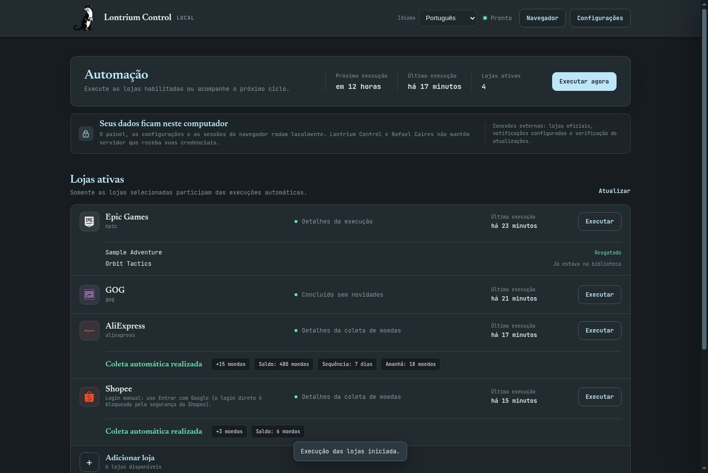
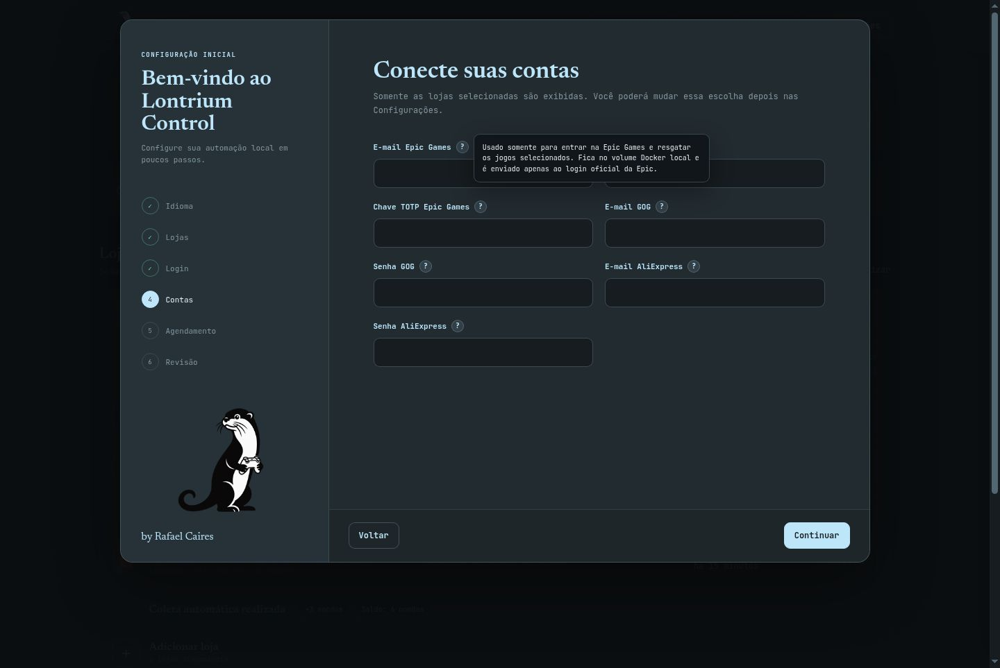
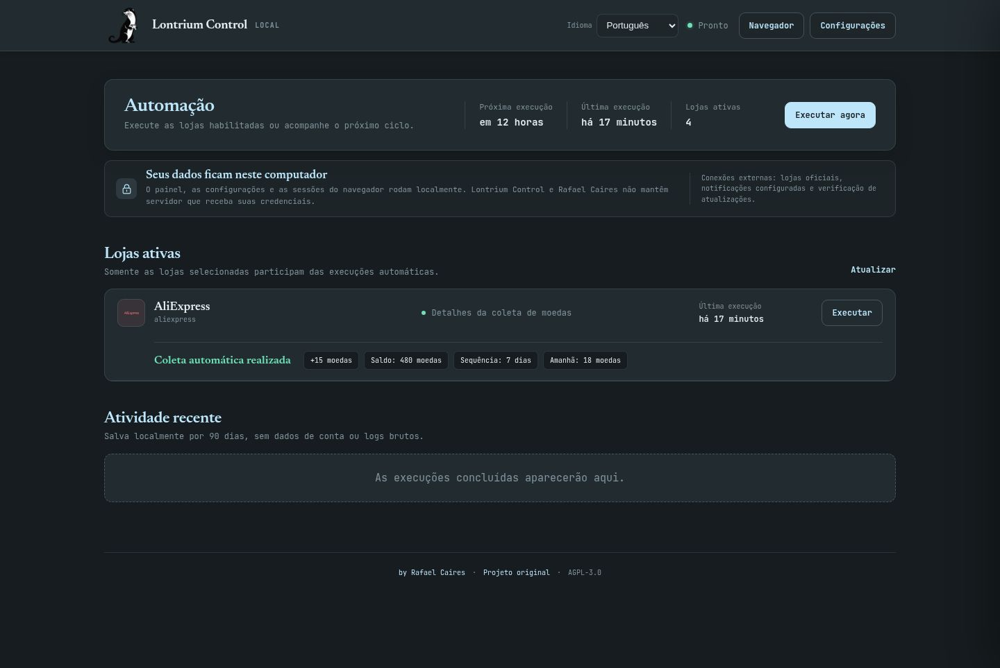

  

<h1 align="center">Lontrium Control</h1>

  <strong>Your free-game claims and daily rewards, organized in one private local dashboard.</strong> 
  Install once, choose your stores, and let Lontrium Control handle the routine.

  
  
  
  

  <a href="./README.md">English</a> ·
  <a href="./docs/README.pt-BR.md">Português do Brasil</a> ·
  <a href="./docs/README.es.md">Español</a>

  <a href="https://github.com/rafaelcairess/lontrium/releases/latest/download/Lontrium-Setup.exe"><strong>Download Lontrium Control for Windows</strong></a>

> [!NOTE]
> **Lontrium Control v1.1.0 is available now.** Download the installer above and verify it with [`SHA256SUMS.txt`](https://github.com/rafaelcairess/lontrium/releases/latest/download/SHA256SUMS.txt).

  

## What it does

- Claims eligible free games, assets and rewards from your selected stores.
- Collects daily coin rewards from AliExpress and Shopee and shows the result and balance.
- Shows the actual result of each run instead of only a generic success count.
- Runs on a schedule and can start automatically with Windows.
- Opens a visual browser whenever a store requires manual login or confirmation.
- Keeps the dashboard, settings, database and browser sessions on your computer.

## Supported services

| Games and assets | Rewards and discovery |
|---|---|
| Epic Games, Steam, GOG, Prime Gaming, Ubisoft, Fab and Unity Asset Store | AliExpress and Shopee daily coins, plus GamerPower giveaway discovery |

GamerPower can also route compatible giveaways from Fanatical, itch.io and IndieGala. Availability and login requirements are controlled by each store.

> [!IMPORTANT]
> **Shopee requires a one-time manual login through _Continue with Google_.** In our live test, Shopee's security rejected direct account login inside the Docker browser, while Google login succeeded. Lontrium does not attempt to bypass that protection; after the Google login, the local persistent browser profile reuses the session.

## Install in three steps

1. Download `Lontrium-Setup.exe` from the [latest Release](https://github.com/rafaelcairess/lontrium/releases).
2. Run it. If Docker Desktop is missing, the launcher explains why it is needed and installs it from Docker's official source only after your confirmation.
3. Follow the local setup assistant: choose a language, select your stores, optionally add credentials, and define the schedule.

That is all. You do not need to clone the repository, edit configuration files or type Docker commands.

The installer may request administrator permission or a Windows restart while Docker Desktop is installed. Because the first installer is unsigned, Windows SmartScreen may display an unknown-publisher warning. Every Release includes `SHA256SUMS.txt` so the download can be verified.

## Your data stays local

Lontrium Control has no account server and includes no telemetry.

| What happens | Where it happens |
|---|---|
| Dashboard and settings | On `127.0.0.1`, available only from this computer |
| Credentials and browser sessions | In the local Docker volume |
| Sanitized run history | In the local SQLite database for 90 days |
| Store login | Directly between the automated browser and the store's official website |
| Saved secret API response | Only `configured: true/false`; the password is never sent back to the dashboard |
| Updates | Checked against this project's official GitHub Releases |

Credentials are optional; manual browser login is always available. Locally saved secrets are not protected by an external encryption server, so your Windows account and disk must remain secure. Lontrium Control never attempts to bypass CAPTCHA, anti-fraud or security challenges.

## Designed for clarity

Only enabled stores appear on the dashboard. Each row reports what happened: which game was claimed, which one was already owned, whether no giveaway was available, or how many AliExpress or Shopee coins were collected.

### Guided account setup

  

### AliExpress coin details

  

Every credential field includes an accessible `?` explanation. The interface supports mouse, keyboard and touch, and is fully translated into English, Brazilian Portuguese and Spanish.

## Daily use

- Open **Lontrium Control** from the Start menu or desktop shortcut.
- Use **Run now** for all enabled stores or run one store individually.
- Use **Browser** when a store asks for login, CAPTCHA or manual confirmation.
- Use **Settings** to change stores, accounts, notifications or scheduling.
- Updates are offered in the dashboard and preserve the local volume.

The normal Windows shortcut checks Docker, starts the service, waits for the dashboard and opens it automatically. For Windows sign-in, the installer offers economy mode (the default), which waits for the claim run and releases Docker's WSL memory, or dashboard mode, which keeps the local panel available. Uninstalling Lontrium Control keeps accounts and sessions by default; deleting local data is a separate, explicit option. Docker Desktop is never removed automatically.

## Need help?

| Problem | What to try |
|---|---|
| Dashboard did not open | Open [http://127.0.0.1:8080](http://127.0.0.1:8080) and confirm Docker Desktop is running. |
| A store needs attention | Open the visual browser from the dashboard and complete the official store prompt. |
| A session expired | Sign in again through the visual browser; the refreshed session is kept locally. |
| A claim failed | Retry the individual store and include the relevant sanitized log when opening an issue. |

For bugs and feature requests, use [GitHub Issues](https://github.com/rafaelcairess/lontrium/issues). Never publish passwords, cookies, TOTP keys, complete network captures or unsanitized screenshots.

## For contributors

The installer is the supported path for end users. Source builds, architecture and environment variables are developer-facing topics:

- [`.env.example`](./.env.example) — complete source-build configuration reference
- [`MODIFICATIONS.md`](./MODIFICATIONS.md) — implementation history and technical differences
- [`CHANGELOG.md`](./CHANGELOG.md) — release changes

The test suite covers store logic, the local API, secret handling, translations, setup flow and the Windows launcher.

## Credits and license

**Lontrium Control interface and Windows distribution:** [Rafael Caires](https://github.com/rafaelcairess).

Built on [P-Adamiec/Free-Games-Claimer-Remaster](https://github.com/P-Adamiec/Free-Games-Claimer-Remaster), maintained by Paweł Adamiec and its contributors. That project was inspired by [vogler/free-games-claimer](https://github.com/vogler/free-games-claimer). Third-party notices are listed in [`THIRD_PARTY_NOTICES.md`](./THIRD_PARTY_NOTICES.md).

Distributed under the [GNU Affero General Public License v3.0](./LICENSE).
